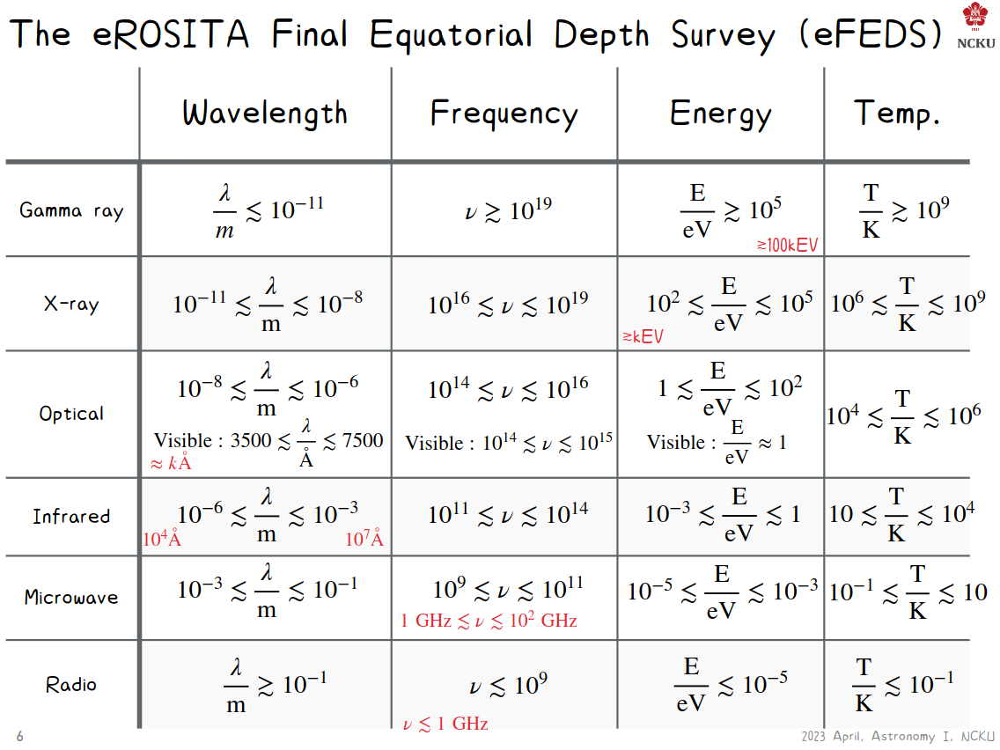

# Telescope

## 光譜

## basics of telescopes

-   aserture size `D`
-   focal length `f`
-   focal ratio `N = $f \over D$`(f-number)
-   magnification `m`
-   resolution `FWHM`(**F**ull **W**idth at **H**alf **M**aximum)

## optical ad NIR

## x-ray

## radio

# formation of star

## Dynamical timescale ($T \rightarrow L$)

$$
\frac{d^2r}{dt^2} = \frac{-GM}{r} \\
\frac{R}{T^2} = \frac{GM}{R^2} \Rightarrow T = \left(\frac{1}{GM/R^3}\right)^{1/2} = \left(\frac{1}{G\rho}\right)^{1/2} \text{(characteristic time scale)}
$$

## Kelvin-Helmholtz time scale(Thermal time scale) ($U \rightarrow L$)

$$
E = K+U \approx \frac 1 2 U \\
(U_{ball} = \frac{-3}5\frac{M^2G}R) \\
E = -\frac{3}{10}\frac{M^2G}{R}
t_{KH} = \frac{\frac{3}{10}\frac{M^2G}{R}}{L} = \frac{3M^G}{10RL}
(L: \text{luminosity (W)})
$$

## nuclear time scale ($mass \rightarrow L$)

$$
t_{nuclear} = \frac{\epsilon Mc^2}{L} \approx 10^{13}(epsilon = 1) >> \text{age of universe} \\
\Rightarrow \epsilon \approx 10^{-3}
$$

## $r_0(M)$

$$
0 + \left(-\frac{GMm}{r_0}\right) = \frac{1}{2}m\left(\frac{dr}{dt}\right)^2+\left(-\frac{GMm}{r}\right) \\
\frac{dr}{dt} = \sqrt{2GM\left(\frac{1}{r}-\frac{1}{r_0}\right)} \\
r = \sqrt{\frac{r_0^3\pi^2}{8GM}} = \sqrt{\frac{\pi^2}{8G\frac{4\pi}{3}\rho}} = \sqrt{\frac{3\pi}{32G\rho}}
$$

## Jeans instability

平均分子量 $\mu_m$

$$
K = N(\frac{1}{2}\mu_m m_pv^2) = \left(\frac{M}{\mu_m m_p}\right)\left(\frac{3}{2}k_BT\right) = \frac{3Mk_BT}{2\mu_m m_p} \\
2K+U < 0 \\
\frac{3Mk_BT}{2\mu_m m_p} < \frac{3M^2G}{5R} \\
M > M_J(\text{Jean's mass}) = \left(\frac{5k_BT}{\mu_m m_pG}\right)^{3/2}\left(\frac{3}{4pi\rho}\right)^{1/2} \propto \frac{T^{3/2}}{\rho^{1/2}} \\
R > R_J = \left(\frac{5k_BT}{\mu_m m_pG}\right)^{1/2}\left(\frac{3}{4pi\rho}\right)^{1/2} \propto \left(\frac{T}{\rho}\right)^{1/2}
$$
