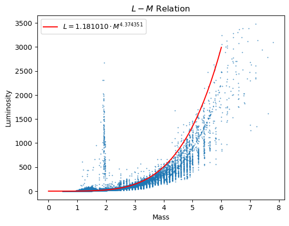

https://gea.esac.esa.int/archive/
```
SELECT TOP 100
dr3main.source_id,
dr3main.random_index,
dr3main.ra,
dr3main.dec,
--- parallax
dr3main.parallax,
dr3main.parallax_error,
dr3main.parallax_over_error,
--- photometry
dr3main.phot_g_mean_mag,
dr3main.phot_g_mean_flux_over_error,
dr3main.phot_bp_mean_mag,
dr3main.phot_bp_mean_flux_over_error,
dr3main.phot_rp_mean_mag,
dr3main.phot_rp_mean_flux_over_error,
dr3main.bp_rp,
dr3main.phot_g_mean_mag + 5.0 * LOG10(dr3main.parallax) - 10.0 as phot_mean_mg,
1.0 / dr3main.parallax_over_error / LOG(10.0)                  as phot_mean_mg_error,
--- Flags
dr3main.phot_variable_flag,
dr3main.in_qso_candidates,
dr3main.in_galaxy_candidates,
dr3main.non_single_star,
--- probabilities
dr3apar.classprob_dsc_combmod_quasar,
dr3apar.classprob_dsc_combmod_galaxy,
dr3apar.classprob_dsc_combmod_star,
dr3apar.classprob_dsc_combmod_whitedwarf,
dr3apar.classprob_dsc_combmod_binarystar,
--- astrophysical parameters
dr3apar.teff_gspphot,
dr3apar.teff_gspphot_lower,
dr3apar.teff_gspphot_upper,
dr3apar.logg_gspphot,
dr3apar.logg_gspphot_lower,
dr3apar.logg_gspphot_upper,
dr3apar.mh_gspphot,
dr3apar.mh_gspphot_lower,
dr3apar.mh_gspphot_upper,
dr3apar.distance_gspphot,
dr3apar.distance_gspphot_lower,
dr3apar.distance_gspphot_upper,
dr3apar.azero_gspphot,
dr3apar.azero_gspphot_lower,
dr3apar.azero_gspphot_upper,
dr3apar.ag_gspphot,
dr3apar.ag_gspphot_lower,
dr3apar.ag_gspphot_upper,
dr3apar.ebpminrp_gspphot,
dr3apar.ebpminrp_gspphot_lower,
dr3apar.ebpminrp_gspphot_upper,
dr3apar.mg_gspphot,
dr3apar.mg_gspphot_lower,
dr3apar.mg_gspphot_upper,
dr3apar.libname_gspphot,
--- flame
dr3apar.radius_flame,
dr3apar.radius_flame_lower,
dr3apar.radius_flame_upper,
dr3apar.lum_flame,
dr3apar.lum_flame_lower,
dr3apar.lum_flame_upper,
dr3apar.mass_flame,
dr3apar.mass_flame_lower,
dr3apar.mass_flame_upper,
dr3apar.age_flame,
dr3apar.age_flame_lower,
dr3apar.age_flame_upper,
dr3apar.flags_flame,
dr3apar.evolstage_flame,
--- synthetic colors
dr3sync.c_star,
dr3sync.u_sdss_mag,
dr3sync.g_sdss_mag,
dr3sync.r_sdss_mag,
dr3sync.i_sdss_mag,
dr3sync.z_sdss_mag,
dr3sync.u_sdss_flux / dr3sync.u_sdss_flux_error AS u_sdss_flux_over_error,
dr3sync.g_sdss_flux / dr3sync.g_sdss_flux_error AS g_sdss_flux_over_error,
dr3sync.r_sdss_flux / dr3sync.r_sdss_flux_error AS r_sdss_flux_over_error,
dr3sync.i_sdss_flux / dr3sync.i_sdss_flux_error AS i_sdss_flux_over_error,
dr3sync.z_sdss_flux / dr3sync.z_sdss_flux_error AS z_sdss_flux_over_error,
dr3sync.u_sdss_flag,
dr3sync.g_sdss_flag,
dr3sync.r_sdss_flag,
dr3sync.i_sdss_flag,
dr3sync.z_sdss_flag

FROM gaiadr3.gaia_source                      AS dr3main
    JOIN gaiadr3.astrophysical_parameters     AS dr3apar
    ON dr3main.source_id = dr3apar.source_id

    JOIN gaiadr3.synthetic_photometry_gspc    AS dr3sync
    ON dr3main.source_id = dr3sync.source_id

WHERE 
        dr3main.parallax_over_error          > 10.0
    AND dr3main.phot_g_mean_flux_over_error  > 20.0
    AND dr3main.phot_bp_mean_flux_over_error > 20.0
    AND dr3main.phot_rp_mean_flux_over_error > 20.0
    AND dr3main.phot_bp_rp_excess_factor < 1.3 + 0.060 * POWER(dr3main.phot_bp_mean_mag - dr3main.phot_rp_mean_mag,2)
    AND dr3main.phot_bp_rp_excess_factor > 1.0 + 0.015 * POWER(dr3main.phot_bp_mean_mag - dr3main.phot_rp_mean_mag,2)
    AND dr3main.visibility_periods_used      > 8
    AND dr3main.astrometric_chi2_al/(dr3main.astrometric_n_good_obs_al - 5) < 1.44 * GREATEST(1,EXP(-0.4 * (dr3main.phot_g_mean_mag - 19.5)))
    AND dr3main.random_index BETWEEN 0 AND 10000000

ORDER BY dr3main.source_id 
```


```python
import numpy as np
import matplotlib.pyplot as plt
import astropy.io.fits as fits
```


```python
path2file = './dr3_tutorial-result.fits'
data = fits.getdata(path2file)
```


```python
print(len(data))
```

    445276


```python
data.dtype.names
```


    ('source_id',
     'random_index',
     'ra',
     'dec',
     'parallax',
     'parallax_error',
     'parallax_over_error',
     'phot_g_mean_mag',
     'phot_g_mean_flux_over_error',
     'phot_bp_mean_mag',
     'phot_bp_mean_flux_over_error',
     'phot_rp_mean_mag',
     'phot_rp_mean_flux_over_error',
     'bp_rp',
     'phot_mean_mg',
     'phot_mean_mg_error',
     'phot_variable_flag',
     'in_qso_candidates',
     'in_galaxy_candidates',
     'non_single_star',
     'classprob_dsc_combmod_quasar',
     'classprob_dsc_combmod_galaxy',
     'classprob_dsc_combmod_star',
     'classprob_dsc_combmod_whitedwarf',
     'classprob_dsc_combmod_binarystar',
     'teff_gspphot',
     'teff_gspphot_lower',
     'teff_gspphot_upper',
     'logg_gspphot',
     'logg_gspphot_lower',
     'logg_gspphot_upper',
     'mh_gspphot',
     'mh_gspphot_lower',
     'mh_gspphot_upper',
     'distance_gspphot',
     'distance_gspphot_lower',
     'distance_gspphot_upper',
     'azero_gspphot',
     'azero_gspphot_lower',
     'azero_gspphot_upper',
     'ag_gspphot',
     'ag_gspphot_lower',
     'ag_gspphot_upper',
     'ebpminrp_gspphot',
     'ebpminrp_gspphot_lower',
     'ebpminrp_gspphot_upper',
     'mg_gspphot',
     'mg_gspphot_lower',
     'mg_gspphot_upper',
     'libname_gspphot',
     'radius_flame',
     'radius_flame_lower',
     'radius_flame_upper',
     'lum_flame',
     'lum_flame_lower',
     'lum_flame_upper',
     'mass_flame',
     'mass_flame_lower',
     'mass_flame_upper',
     'age_flame',
     'age_flame_lower',
     'age_flame_upper',
     'flags_flame',
     'evolstage_flame',
     'c_star',
     'u_sdss_mag',
     'g_sdss_mag',
     'r_sdss_mag',
     'i_sdss_mag',
     'z_sdss_mag',
     'u_sdss_flux_over_error',
     'g_sdss_flux_over_error',
     'r_sdss_flux_over_error',
     'i_sdss_flux_over_error',
     'z_sdss_flux_over_error',
     'u_sdss_flag',
     'g_sdss_flag',
     'r_sdss_flag',
     'i_sdss_flag',
     'z_sdss_flag')


# Stars Distribution


```python
plt.plot(data['ra'], 
         data['dec'], 
         ',')

plt.xlabel('ra')
plt.ylabel('dec')
plt.title('Distribution')

plt.show()
```


    

    


# (I) HR Diagram
Using the catalog, make two versions of the HR diagram.  
In the first HR diagram, use the derived temperature ($T_{eff}$) and luminosity ($L$) as the x and y axes,  
respectively. In addition, colorize the plot using the derived mass. **[5 pts]**  


```python
temperature = data['teff_gspphot']
luminosity = data['lum_flame'],
mass = data['mass_flame']

# plt.plot(temperature, luminosity, ',')
plt.scatter(temperature, luminosity, c = np.log10(mass), s = 0.1)
plt.colorbar()

plt.yscale('log')

plt.xlim([12500, 2500])
plt.ylim([1e-3, 8e3])

plt.xlabel('Temperature [K]')
plt.ylabel('Lumunosity [Lsolar]')
plt.title('HR-diagram')

plt.show()
```


    

    


In the second diagram, as referred to as the color-magnitude diagram (CMD), use the observed  
color ($G_{BP}-G_{rp}$) and absolute magnitude ($G_{abs}$) as the x and y axes, respectively. In addition,  
colorize the plot using the derived iron abundance ($[Fe/H$). **[5 pts]**  


```python
x = data['bp_rp']
y = data['phot_mean_mg'],
c = data['mh_gspphot']

# plt.plot(temperature, luminosity, ',')
plt.scatter(x, y, c = c, s = 0.1)
plt.colorbar()

plt.gca().invert_yaxis()

plt.xlabel('Observed Color')
plt.ylabel('Absolute Magnitude')
plt.title('Color-magnitude Diagram(CMD)')

plt.show()
```


    

    


# (II) Theoretically Predicted
Continued from (I). In the first version of the HR diagram (i.e., the luminosity v.s. temperature  
diagram), over-plot the theoretically predicted $L-T_{eff}$ relation of main-sequence stars assuming  
that the main-sequence stars (1) are perfect blackbody, (2) have uniform mass density $\rho = \rho_\odot$,  
where $\rho_\odot$ is the mass density of the Sun, and (3) satisfy the Virial theorem. **[12 pts]**  


```python
def calcL(temperature, radius):
    sigma = 5.6e-8
    Lsun = 3.8e26
    return 4*np.pi*radius**2*sigma*temperature**4 / Lsun
```


```python
# theoretically
temperature_array = [i for i in range(1000, 20000, 500)]
lum = [calcL(temperature, radius = 7e8) for temperature in temperature_array]

plt.plot(temperature_array, lum, 'o')

temperature = data['teff_gspphot']
luminosity = data['lum_flame'],
mass = data['mass_flame']

# plt.plot(temperature, luminosity, ',')
plt.scatter(temperature, luminosity, c = np.log10(mass), s = 0.1)
plt.colorbar()

plt.yscale('log')

plt.xlim([12500, 2500])
plt.ylim([1e-3, 8e3])

plt.xlabel('Temperature [K]')
plt.ylabel('Lumunosity [Lsolar]')
plt.title('HR-diagram with theoretically')

plt.show()
```


    

    


# (III) Color-color Diagram
Make the color-color (CC) diagram with the SDSS colors $g_{SDSS}-r_{SDSS}$ and $r_{SDSS}-i_{SDSS}$ as the  
y and x axes, respectively. In addition, colorize the plot using the derived iron abundance  
($[Fe/H]$). **[5 pts]**


```python
ri = data['r_sdss_mag']-data['i_sdss_mag']
gr = data['g_sdss_mag']-data['r_sdss_mag']
c = data["mh_gspphot"]

plt.scatter(ri, gr, c = c, s = 0.1, alpha = 0.5)

plt.xlabel('$g_{SDSS}-r_{SDSS}$')
plt.ylabel('$r_{SDSS}-i_{SDSS}$')
plt.title('CC-diagram')

plt.show()
```


    

    


# (IV) CC Diagram with Theoretically
Continued from (III). Assuming that main-sequence stars are (1) are perfect blackbody, (2) have  
uniform mass density $\rho = \rho_\odot$, where $\rho_\odot$ is the mass density of the Sun, and (3) satisfy the Virial  
theorem, and that the SDSS filter transmissions have a transmission rate of 100%, over-plot the  
theoretical prediction of the the main-sequence stars on the color-color diagram of $g_{SDSS}-r_{SDSS}$  
and $r_{SDSS}-i_{SDSS}$ you made in (III). **[12 pts]**


```python
def bb_flux_at_lam(lam, T = 6000.0, **kwargs):
    # sanitize
    lam = np.array(lam, ndmin = 1)
    T = float(T)
    G = 6.7E-11
    h   = 6.6E-34
    kb = 1.38E-23
    c = 3.0E8
    
    intensity = 2.0 / lam**5 * h * c**2 * 1.0 / (np.exp(h * c / kb / T / lam) - 1)
    flux = np.pi * intensity
    
    return flux

def bb_flux_between_lam(lam1, lam2, T = 6000.0):
    lam1 = float(lam1)
    lam2 = float(lam2)
    T = float(T)

    # integral
    delta_lam = 2.0E-8
    lam_array = np.arange(lam1, lam2, delta_lam)
    flu_array = np.array([ bb_flux_at_lam(lam = ll, T = T) for ll in lam_array ])
    intgrtd_flux = np.sum(flu_array) * delta_lam
    
    return intgrtd_flux


def bb_mag_between_lam(lam1, lam2, T = 6000.0):
    intgrtd_flux = bb_flux_between_lam(lam1 = lam1, lam2 = lam2, T = T)
    mag = -2.5 * np.log10(intgrtd_flux)

    return mag
```


```python
gmag = np.array([ bb_mag_between_lam(lam1 = 4000.0E-10, lam2 = 5500.0E-10, T = t) for t in temperature_array ])
rmag = np.array([ bb_mag_between_lam(lam1 = 5500.0E-10, lam2 = 6800.0E-10, T = t) for t in temperature_array ])
imag = np.array([ bb_mag_between_lam(lam1 = 6800.0E-10, lam2 = 8000.0E-10, T = t) for t in temperature_array ])
```


```python
ri = data['r_sdss_mag']-data['i_sdss_mag']
gr = data['g_sdss_mag']-data['r_sdss_mag']
c = data["mh_gspphot"]

plt.scatter(ri, gr, c = c, s = 0.1, alpha = 0.5)
plt.plot(rmag - imag, gmag - rmag)
plt.colorbar()

plt.xlabel('$g_{SDSS}-r_{SDSS}$')
plt.ylabel('$r_{SDSS}-i_{SDSS}$')
plt.title('CC-diagram with theoretically')

plt.show()
```


    

    


# (V) $L-M$ Relation from GAIA
Plot the $L-M$ relation using the GAIA catalog. Estimate the slope $\alpha$ such that $L \propto M^\alpha$. **[8 pts]**


```python
M = data['mass_flame']
L = data['lum_flame']

isNaN = np.logical_not(np.logical_or(np.isnan(M), np.isnan(L)))
M = M[isNaN]
L = L[isNaN]
```


```python
lnM = np.log(M)
lnL = np.log(L)

plt.scatter(lnM, lnL, s = 0.2)

fit = np.polyfit(lnM, lnL, 1)
x = (np.min(lnM), np.max(lnM))
plt.plot(x, 
         np.poly1d(fit)(x), 
         color='red',
         label='ln(L) = ln({:.6f}) + {:.6f} ln(M)'.format(fit[1], fit[0]))

plt.xlabel('ln(Mass)')
plt.ylabel('ln(Luminosity)')
plt.title('$L-M$ Relation')
plt.legend(loc = 'upper left')

plt.show()

# =======================================================================#

print('alpha = {:.6f}'.format(fit[0]))

# =======================================================================#

plt.scatter(M, L, s = 0.2)
x = np.linspace(0, 6, 50)
plt.plot(x, 
         np.exp(fit[1])*np.power(x, fit[0]),
         color='red',
         label='$L={:.6f} \cdot M^{{{:.6f}}}$'.format(np.exp(fit[1]), fit[0]))

plt.xlabel('Mass')
plt.ylabel('Luminosity')
plt.title('$L-M$ Relation')
plt.legend(loc = 'upper left')

plt.show()
```


    

    


    alpha = 4.374351


    

    


# Trying to Remove Strange Data That $|M - 2| < 0.2$


```python
d = 0.2
m = M[(M < 2-d) | (M > 2+d)]
l = L[(M < 2-d) | (M > 2+d)]
    
lnm = np.log(m)
lnl = np.log(l)
fit = np.polyfit(lnm, lnl, 1)

plt.scatter(m, l, s = 0.2)
x = np.linspace(0, 6, 50)
plt.plot(x, 
         np.exp(fit[1])*np.power(x, fit[0]),
         color='red',
         label='$L={:.6f} \cdot M^{{{:.6f}}}$'.format(np.exp(fit[1]), fit[0]))

plt.xlabel('Mass')
plt.ylabel('Luminosity')
plt.title('$L-M$ Relation')
plt.legend(loc = 'upper left')

plt.show()
```


    

    

