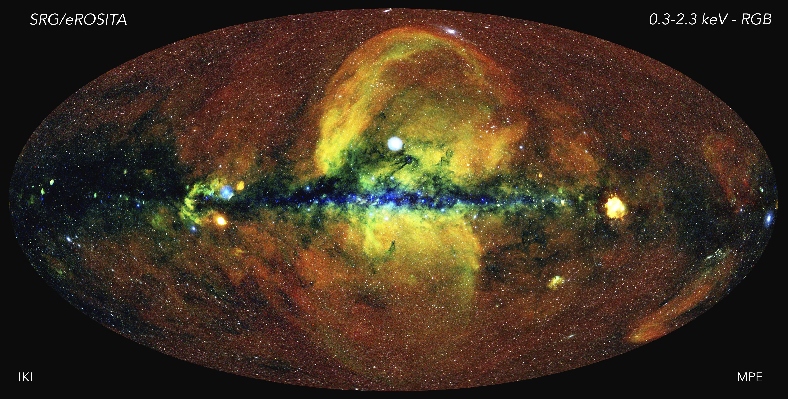

# 天文學一第一次作業
陳宏彰

---

## What are the Millennium and illustrisTNG simulations?
Millennium simulation 是對於宇宙物質與暗物質的 N 體問題模擬，專注於觀察星系的形成過程，並和現實觀察比對。團隊成員包括來自德國、英國、加拿大、日本和美國的科學家。這個計畫的成果在 2005 年發表，是近代宇宙學很重要的一個模擬計畫。

illustrisTNG simulation 是一系列對於大型宇宙磁流體的模擬，一樣是為了了解星系的形成。這個計畫還正在進行，有三個不同的體積、解析度的項目正在進行：TNG 50、TNG 100、TNG 300，其中的數字代表著模擬的區域大小，50、100、300 分別代表 50 Mpc、100Mpc、300Mpc。

## What are the SDSS survey? How about the Dark Energy Survey (DES) and Hyper Suprime-Cam (HSC) Survey?
SDSS survey 是一個巡天計畫，這個計畫搜尋四分之一的天空，觀測天體的紅移資料，希望找到紅移大於 6 的類星體

DES 是專注於尋找宇宙中暗能量的巡天計畫，他主要觀測南天球，透過超新星的極端環境去尋找暗能量的蹤跡。根據官網介紹，除了花六年觀測了 5000 平方角度的天空，每週還會觀測一小塊天區，尋找像是超新星這類的 transient 事件

HSC 是由日本、臺灣和普林斯頓大學主導的巡天計畫，主要觀測範圍是赤道附近的帶狀區域，這個計畫使用三層、多頻段觀測。根據官網的介紹，邱奕儂老師參與了星團工作組（應該是這樣翻譯吧？

## What is the eROSITA All-Sky Survey (eRASS)? And how does the all-sky map look like?
eROSITA 是的德國和俄羅斯合作的一個衛星巡天計畫，2019 年發射到圍繞第二拉格朗日點的軌道，這是一個全天的 x 射線巡天計畫。以下是他在 0.3~2.3 keV 的全天觀測結果

> https://en.wikipedia.org/wiki/EROSITA#/media/File:SRG-eROSITA_all-sky_image.jpg

## 參考資料
* https://en.wikipedia.org/wiki/Millennium_Run
* https://www.tng-project.org/
* https://zh.wikipedia.org/wiki/%E5%8F%B2%E9%9A%86%E6%95%B8%E4%BD%8D%E5%B7%A1%E5%A4%A9
* https://www.darkenergysurvey.org/
* https://hsc.mtk.nao.ac.jp/ssp/survey/
* https://en.wikipedia.org/wiki/EROSITA

