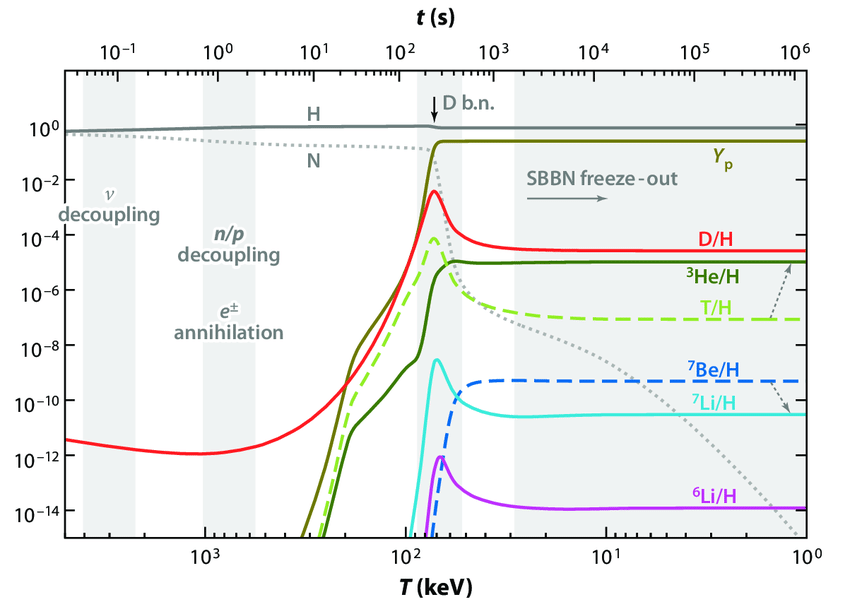
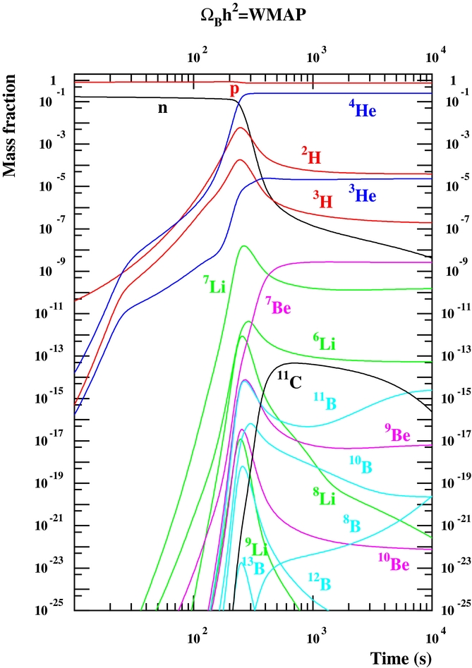
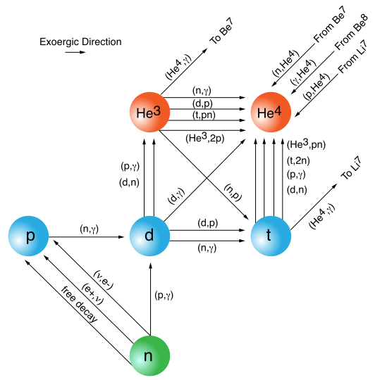

# Question 1
Find the graph about the mass fractions of isotopes in the Big Bang Nucoeosynthesis(BBN). Try to explain what you found.

> 
> source: https://www.researchgate.net/publication/262004321_S-factor_measurement_of_the_2Halphagamma6Li_reaction_at_energies_relevant_for_Big-Bang_ucleosynthesis

<!--

> source https://www.researchgate.net/figure/Standard-big-bang-nucleosynthesis-production-of-H-He-Li-Be-and-B-isotopes-as-a_fig3_51915118
-->

在宇宙形成初期，氫逐漸合成其他元素如 $\ce{^2H}$、$\ce{^3H}$、$\ce{^3He}$ 等等輕元素，在並在後續的反應中形成 $\ce{^7Li}$、$\ce{^7Be}$、$\ce{^8Be}$ 等等較重的元素

> 
> source: https://cococubed.com/code_pages/net_bigbang.shtml

# Question 2.
Find the rest mass of protons, electrons and hydrogens. Use what you found to calcute the binding energy of a hydrogen(13.6eV).

$$\ce{^1_1p^+ + e^- \rightarrow ^1_1H}$$
$$\Delta m = m_H - (m_p + m_e)$$
$$E = \Delta m c^2$$

| element | mass(kg)                                              | source                                                       |
| :-----: | :---------------------------------------------------- | :----------------------------------------------------------- |
|  $m_H$  | $1.007825031898(Da) \\= 1.6735237 \cdot 10^{-27}(kg)$ | https://en.wikipedia.org/wiki/Isotopes_of_hydrogen           |
|  $m_p$  | $1.67262 \cdot 10^{-27}(kg)$                          | https://www.britannica.com/science/proton-subatomic-particle |
|  $m_e$  | $9.109 \cdot 10^{-31}(kg)$                            | https://en.wikipedia.org/wiki/Electron_mass                  |

$$
\begin{align*}
\Delta m &= 1.6735 \cdot 10^{-27} - (1.6726 \cdot 10^{-27} + 9.109 \cdot 10^{-31}) (kg) &= -1.09 \cdot 10^{-32} (kg) \\
&= -1.09 \cdot 10^{-32} (kg)\times (3 \cdot 10^8)^2 (J / kg) &= -9.81 \cdot 10^{-16} (J) \\
&= {-9.81 \cdot 10^{-16} (J) \over (1.602 \cdot 10^{-19}) (J/eV)} &= -6123.6 (eV)
\end{align*}
$$

> Da to Kg: https://www.unitconverters.net/weight-and-mass/dalton-to-kilogram.htm
