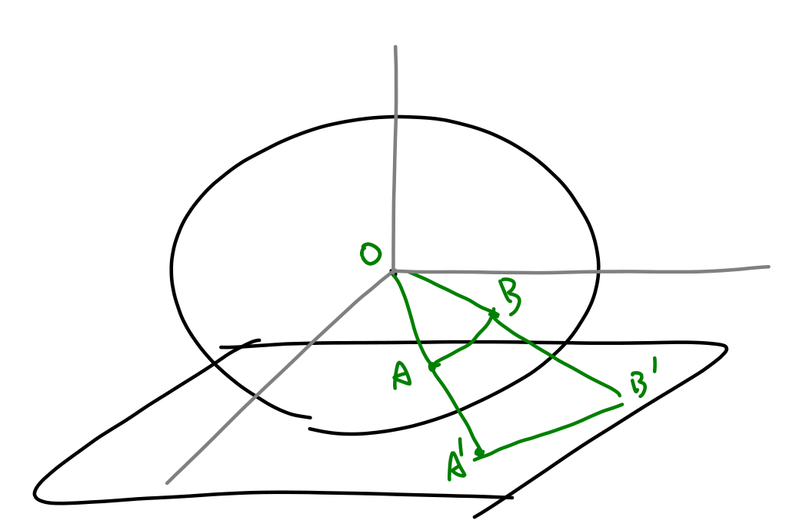

# Question 1.

Please explain the property of the gnomonic projection(tangent plane projection) that any straight line on the tangent plane is the projection of a great circle.

因為是投影，所以 $O$、$A$、$A'$ 在一直線上，$O$、$B$、$B'$ 也在一直線上，用這兩條直線可以在空間中建構唯一一個平面。平面和球切出一個園，和投影面切出一條直線，圓的投影就是投影面上的直線。因此這條直線就是球上的大圓線的投影

<!--缺一個數學的證明-->

# Question 2.

Please explain what a "Mollweide projection" is.

Mollweide projection 是一種圓柱投影，他的特點是面積正確，但是形狀、相對角度（方向）和距離等等訊息就會失真。如果選取適當的投影方向，適合用在小範圍的地圖，面積正確且形狀距離的失真不會太明顯
