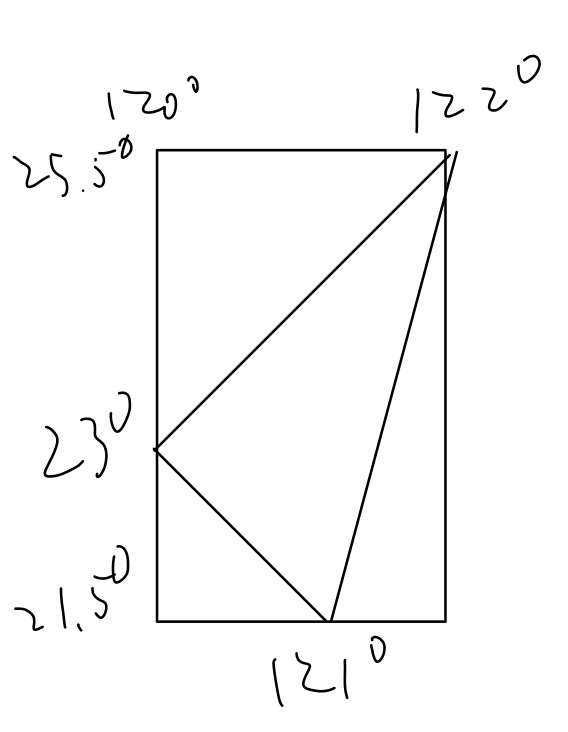

# Question 1.

Q:By definition,list the right ascension and declination of the Sun when it is at the vernal equinox, the summer solstice, the autumnal equinox, and the winter solstice.

|       time       | right ascension |  declination   |
| :--------------: | :-------------: | :------------: |
|  vernal equinox  |       0h        |   $0\degree$   |
| summer solstice  |       6h        | $23.5\degree$  |
| autumnal equinox |       12h       |   $0\degree$   |
| winter solstice  |       18h       | $-23.5\degree$ |

# Question 2.

## (a)

Q:Please estimate the solid angle spanned by the main island of Taiwan by using it's range of the longitude and latitude.

$$
\begin{align*}
\Omega_{Taiwan} =& (122\degree-120\degree)\times(25.5\degree-21.5\degree) - \frac{(122\degree-120\degree)\times(25.5\degree-23\degree)}{2} \\
-& \frac{(23\degree-21.5\degree)\times(121\degree-120\degree)}{2} - \frac{(122\degree-121\degree)\times(23.5\degree-21.5\degree)}{2} \\
=& 3.75 \degree^2 \approx 0.00114231532 (rad^2)
\end{align*}
$$

## (b)

Q:Given that the radius ofthe earth is about 6400km, what is the approximated area of the main island of Taiwan?

$$
A_{Tawian} = \Omega_{Taiwan}\times R^2 \approx 46789.24 (km^2)
$$

## (c\)

Q:Calculate the total surface area of the earth. What is the fraction of the area of Taiwan's main island with respect to the total surface of the earth?

$$
\frac{A_{Taiwan}}{A_{Earth}} = \frac{\Omega_{Taiwan}}{\Omega_{Earth}} = \frac{0.00114231532}{4\pi} = 9.09 \times 10^{-5}
$$

# Question 3.

Q:Why do we always see the same side of the moon?(Why is the period of the moon's spin equal to that of it's orbiting aboutthe earth?) Please explain.

根據理論，潮汐力會將衛星的自轉動能轉換成公轉動能，也就是說自轉會越來越慢，公轉會越來越快，直到公轉和自轉兩個的角速度吻合，這時候行星就對衛星潮汐鎖定，衛星就只能以同一面面對行星了。
