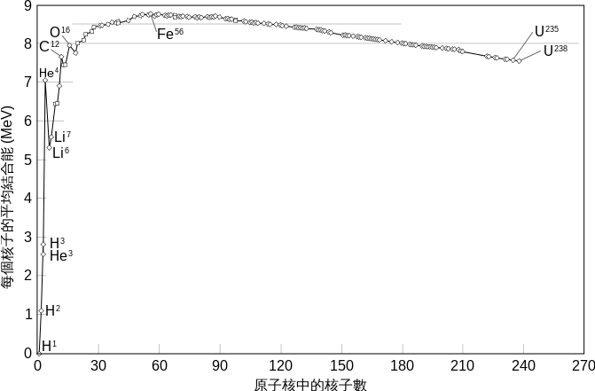

# P-P chain

p-p chain 是恆星內把氫轉化成氦的機制，branch I 具體如下

$$
\ce{p + p -> ^2_1D + e+ + \mu_e} \\
$$

$$
\ce{^2_1D + ^1_1H -> ^3_2He + \gamma} \\
$$

$$
\ce{^3_2H + ^3_2H -> ^4_2H + 2 _1^1H + energy}
$$

# CNO cycle

CNO cycle 也是恆星中把氫轉化成氦的機制，CNO cycle 又分成冷循環和熱循環，熱循環需要比恆星更高的溫度壓力，會發生在新星或是 x-ray 爆之類的事件中

## CNO I

$$
\ce{^12_6C ->[^1_1H] ^13_7N -> ^13_6C + e+ ->[^1_1H] ^14_7N ->[^1_1H] ^15_8O -> ^15_7N + e+ ->[^1_1H] ^12_6C + ^4_2He} \\
$$

$$
\Rightarrow \ce{4 ^1_1H ->[^12_6C] ^4_2He + 2e+}
$$

## CNO II

$$
\ce{^15_7N ->[^1_1H] ^16_8O ->[^1_1H] ^17_9F -> ^17_8O + e+ ->[^1_1H] ^14_7N + ^4_2He ->[^1_1H] ^15_8O -> ^15_7N + e+} \\
$$

$$
\Rightarrow \ce{4 ^1_1H ->[^15_7N] ^4_2He + 2e+}
$$

## CNO III

$$
\ce{^17_8O ->[^1_1H] ^18_9F -> ^18_8O + e+ ->[^1_1H] ^15_7N + ^4_2He ->[^1_1H] ^16_8O ->[^1_1H] ^17_9F -> ^17_8O + e+} \\
$$

$$
\Rightarrow \ce{4 ^1_1H ->[^17_8O] ^4_2He + 2e+}
$$

## CNO IV

$$
\ce{^18_8O ->[^1_1H] ^19_9F ->[^1_1H] ^16_8O + ^4_2He ->[^1_1H] ^17_9F -> ^17_8O + e+ ->[^1_1H] ^18_9F -> ^18_8O + e+} \\
$$

$$
\Rightarrow \ce{4 ^1_1H ->[^18_8O] ^4_2He + 2e+}
$$

# triple-alpha process

triple-alpha process 是恆星中把三個氦轉變成一個碳的過程

$$
\ce{^4_2He + ^4_2He -> ^8_4Be} \\
$$

$$
\ce{^8_4Be + ^4_2He -> ^12_6C + 2\gamma}
$$

# Explain why the nuclear fusion of stars ends with iron cores?
在核反應的束縛能圖中（如下），不管是從氫開始核融合，還是從鈾開始核分裂，到鐵之後都是能量最高峰，這意味著鐵無論是核分裂還是核融合都須要消耗能量，因此恆星中反應傾向在到鐵之後就停止

|                                              |
| :---:                                                     |
| https://zh.wikipedia.org/wiki/%E9%90%B5%E5%B3%B0%E9%A0%82 |

